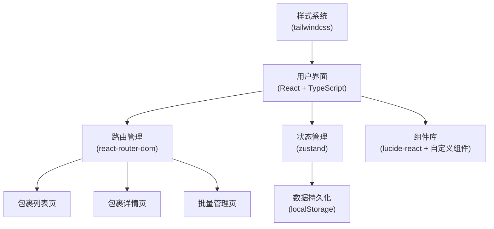
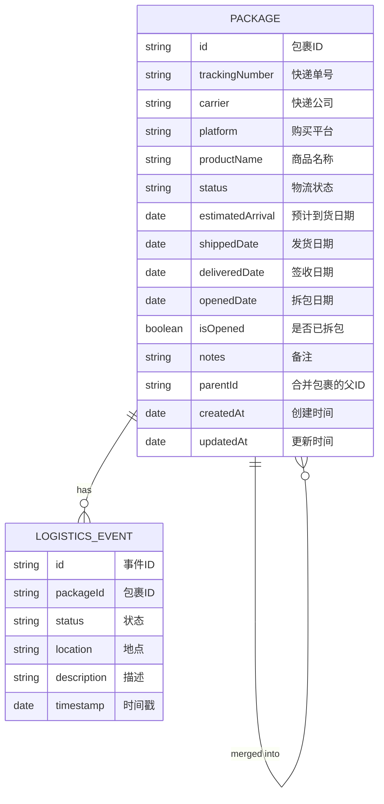

## 1. 架构设计



## 2. 技术描述

- **前端框架**：React@18 + TypeScript
- **构建工具**：Vite
- **状态管理**：zustand
- **路由管理**：react-router-dom
- **样式方案**：tailwindcss@3
- **图标库**：lucide-react
- **数据存储**：localStorage（浏览器本地存储）
- **初始化工具**：vite-init
- **后端**：无（纯前端应用，数据本地存储）

## 3. 路由定义

| 路由 | 页面 | 功能 |
|------|------|------|
| `/` | 包裹列表页 | 展示所有包裹、筛选、搜索、新增入口 |
| `/package/:id` | 包裹详情页 | 物流时间线、状态管理、拆包标记 |
| `/batch` | 批量管理页 | 批量导入、包裹合并、批量操作 |

## 4. 数据模型

### 4.1 数据模型定义



### 4.2 TypeScript 类型定义

```typescript
type PackageStatus = 'shipped' | 'in_transit' | 'out_for_delivery' | 'delivered' | 'opened';

interface LogisticsEvent {
  id: string;
  packageId: string;
  status: PackageStatus;
  location: string;
  description: string;
  timestamp: Date;
}

interface Package {
  id: string;
  trackingNumber: string;
  carrier: string;
  platform: string;
  productName: string;
  status: PackageStatus;
  estimatedArrival: Date | null;
  shippedDate: Date | null;
  deliveredDate: Date | null;
  openedDate: Date | null;
  isOpened: boolean;
  notes: string;
  parentId: string | null;
  childIds: string[];
  createdAt: Date;
  updatedAt: Date;
  logisticsEvents: LogisticsEvent[];
}

interface PackageStore {
  packages: Package[];
  selectedPackageId: string | null;
  filterStatus: PackageStatus | 'all';
  searchQuery: string;
  addPackage: (pkg: Omit<Package, 'id' | 'createdAt' | 'updatedAt' | 'logisticsEvents'>) => void;
  updatePackage: (id: string, updates: Partial<Package>) => void;
  deletePackage: (id: string) => void;
  markAsOpened: (id: string) => void;
  updateStatus: (id: string, status: PackageStatus) => void;
  mergePackages: (parentId: string, childIds: string[]) => void;
  unmergePackage: (id: string) => void;
  batchAddPackages: (pkgs: Omit<Package, 'id' | 'createdAt' | 'updatedAt' | 'logisticsEvents'>[]) => void;
  batchUpdateStatus: (ids: string[], status: PackageStatus) => void;
  batchDelete: (ids: string[]) => void;
  setFilterStatus: (status: PackageStatus | 'all') => void;
  setSearchQuery: (query: string) => void;
  selectPackage: (id: string | null) => void;
  exportData: () => string;
  importData: (json: string) => void;
}
```

## 5. 目录结构

```
t:\zijie\31
├── src/
│   ├── components/
│   │   ├── PackageCard.tsx       # 包裹卡片组件
│   │   ├── PackageForm.tsx       # 新增包裹表单
│   │   ├── LogisticsTimeline.tsx # 物流时间线
│   │   ├── StatusBadge.tsx       # 状态标签
│   │   ├── FilterBar.tsx         # 筛选栏
│   │   ├── StatisticsBar.tsx     # 统计概览
│   │   ├── BatchImportForm.tsx   # 批量导入表单
│   │   ├── MergePanel.tsx        # 合并面板
│   │   └── Modal.tsx             # 弹窗组件
│   ├── pages/
│   │   ├── PackageList.tsx       # 包裹列表页
│   │   ├── PackageDetail.tsx     # 包裹详情页
│   │   └── BatchManagement.tsx   # 批量管理页
│   ├── store/
│   │   └── usePackageStore.ts    # zustand状态管理
│   ├── utils/
│   │   ├── mockData.ts           # Mock数据生成
│   │   ├── storage.ts            # localStorage工具
│   │   ├── statusUtils.ts        # 状态相关工具函数
│   │   └── carrierUtils.ts       # 快递公司识别
│   ├── types/
│   │   └── index.ts              # 类型定义
│   ├── App.tsx
│   ├── main.tsx
│   └── index.css
├── .trae/
│   └── documents/
│       ├── PRD.md
│       └── ARCHITECTURE.md
├── package.json
├── vite.config.ts
├── tailwind.config.js
├── tsconfig.json
└── index.html
```

## 6. 核心功能实现说明

### 6.1 物流状态管理

- 状态流转：已发货 → 运输中 → 派送中 → 已签收 → 已拆包
- 每种状态对应不同颜色和图标
- 状态变更自动记录时间戳

### 6.2 快递单号识别

- 根据单号前缀识别快递公司（顺丰、圆通、中通、韵达、申通、京东等）
- 自动生成模拟物流事件（由于没有真实物流API，使用Mock数据）

### 6.3 数据持久化

- 使用zustand的persist中间件自动同步到localStorage
- 支持导出JSON备份和导入恢复

### 6.4 批量导入

- 支持粘贴多个快递单号（换行或逗号分隔）
- 批量解析并生成包裹记录
- 显示导入进度和结果统计

### 6.5 包裹合并

- 支持多选包裹进行合并
- 合并后以主包裹展示，可展开查看子包裹
- 支持解除合并

## 7. Mock数据说明

由于没有真实物流API，将使用Mock数据模拟物流信息：
- 新增包裹时自动生成3-6条物流事件
- 物流事件时间按合理间隔分布
- 根据快递公司生成不同的物流节点描述
