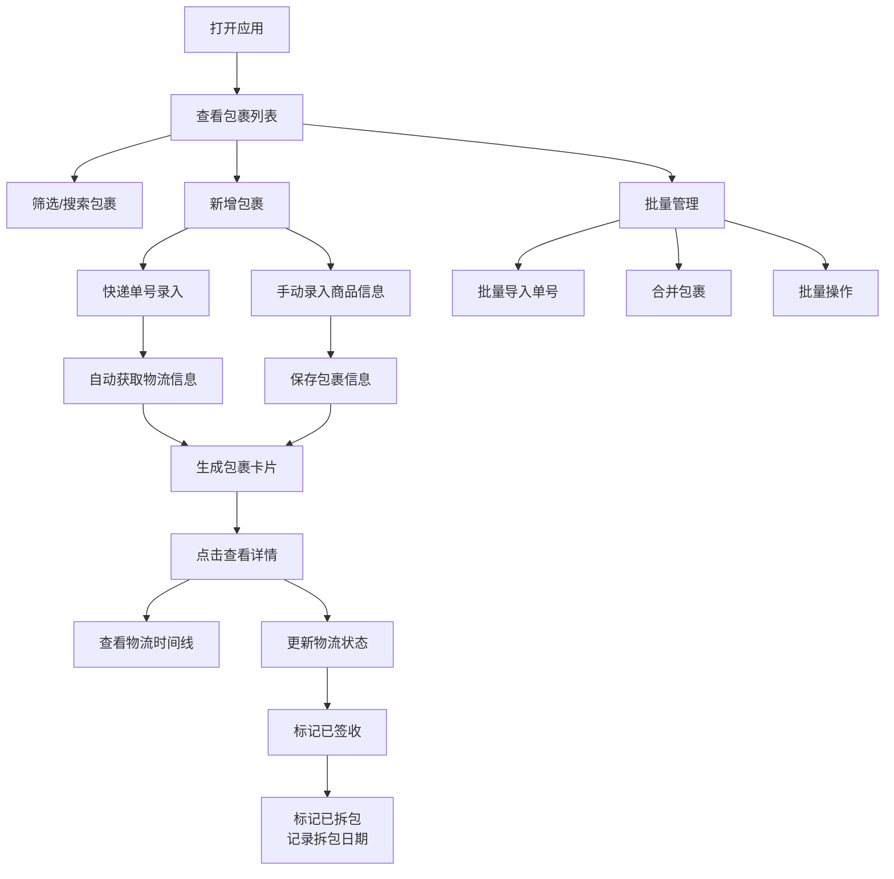

## 1. 产品概述

快递追踪与到货管理工具，帮助用户一站式管理所有网购包裹的物流状态，解决大促期间多平台、多包裹难以追踪的痛点。

- **主要用途**：追踪快递物流、管理到货状态、记录拆包信息、批量管理包裹
- **目标用户**：频繁网购用户、大促期间购物者、需要管理多包裹的消费者
- **产品价值**：告别多平台切换，统一管理所有包裹，实时掌握物流动态

## 2. 核心功能

### 2.1 用户角色

| 角色 | 注册方式 | 核心权限 |
|------|----------|----------|
| 普通用户 | 无需注册，本地使用 | 完整的包裹管理、状态追踪、批量操作权限 |

### 2.2 功能模块

1. **包裹列表页**：包裹总览、状态筛选、搜索功能
2. **新增包裹**：快递单号录入、手动录入商品信息
3. **包裹详情**：物流时间线、状态管理、拆包标记
4. **批量管理**：批量导入、多包裹合并、批量操作

### 2.3 页面详情

| 页面名称 | 模块名称 | 功能描述 |
|----------|----------|----------|
| 包裹列表页 | 顶部导航 | 标题、统计概览、新增按钮、批量操作入口 |
| 包裹列表页 | 筛选栏 | 按物流状态筛选（全部/已发货/运输中/派送中/已签收/已拆包）、搜索框 |
| 包裹列表页 | 包裹卡片列表 | 展示所有包裹卡片，支持点击查看详情 |
| 新增包裹弹窗 | 快递单号录入 | 输入单号自动识别快递公司、获取物流信息 |
| 新增包裹弹窗 | 手动录入表单 | 购买平台、商品名称、预计到货日期、备注 |
| 包裹详情页 | 物流时间线 | 展示完整物流节点，高亮当前状态 |
| 包裹详情页 | 状态管理 | 更新物流状态、标记已签收、标记已拆包 |
| 批量管理页 | 批量导入 | 大促期间批量粘贴多个快递单号 |
| 批量管理页 | 包裹合并 | 相同订单的多个包裹合并管理 |
| 批量管理页 | 批量操作 | 批量标记状态、批量删除 |

## 3. 核心流程

用户打开应用后，首先看到包裹总览列表，可通过筛选快速定位特定状态的包裹。点击新增按钮，可选择输入快递单号（自动获取物流信息）或手动填写商品信息。包裹在列表中以卡片形式展示，根据物流状态显示不同颜色。点击包裹卡片查看详情，可看到完整物流时间线，签收后可标记"已拆包"并记录拆包日期。大促期间，用户可使用批量导入功能一次性添加多个包裹，也可将相关包裹合并管理。

## 4. 用户界面设计

### 4.1 设计风格

- **主色调**：深海蓝 `#0F172A` 作为背景色，营造专业可靠的氛围
- **辅助色**： 
  - 已发货：琥珀橙 `#F59E0B`
  - 运输中：天空蓝 `#3B82F6`
  - 派送中：紫罗兰 `#8B5CF6`
  - 已签收：翡翠绿 `#10B981`
  - 已拆包：森林绿 `#059669`
- **字体**：使用 `Space Grotesk` 作为标题字体，`Inter` 作为正文字体（注：为避免通用字体，实际使用 `Sora` 作为正文字体）
- **按钮风格**：圆角12px，微妙阴影，hover时有轻微上移动画
- **布局风格**：卡片式布局，玻璃态效果，微妙渐变背景
- **图标风格**：使用 `lucide-react` 线性图标，与状态颜色对应

### 4.2 页面设计概述

| 页面名称 | 模块名称 | UI元素 |
|----------|----------|--------|
| 包裹列表页 | 顶部导航 | 大字号标题、统计数字卡片（各状态数量）、渐变背景条 |
| 包裹列表页 | 筛选栏 | Pill形筛选按钮，选中时有填充效果和动画 |
| 包裹列表页 | 包裹卡片 | 左侧状态色条、平台图标、商品名称、快递单号、当前状态、预计/实际日期、hover时上浮阴影 |
| 新增包裹弹窗 | 表单 | 双标签切换（快递单号/手动录入）、输入框带图标、日期选择器、提交按钮有加载动画 |
| 包裹详情页 | 物流时间线 | 垂直时间线、节点圆点带状态色、连线动画、最新节点高亮脉冲效果 |
| 批量管理页 | 批量导入 | 大文本框支持粘贴多个单号、解析预览、导入进度条 |
| 批量管理页 | 包裹合并 | 拖拽选择、合并预览、合并后可展开查看子包裹 |

### 4.3 响应性

- **桌面优先**：1200px以上展示完整布局，包裹卡片3列网格
- **平板适配**：768-1200px，包裹卡片2列网格
- **手机适配**：768px以下，包裹卡片单列，顶部导航简化，底部浮动新增按钮
- **触摸优化**：所有可点击元素最小48x48px，手势滑动删除/标记

## 5. 数据持久化

- 使用 `localStorage` 存储所有包裹数据
- 数据自动保存，刷新页面不丢失
- 支持导出JSON备份和导入恢复
